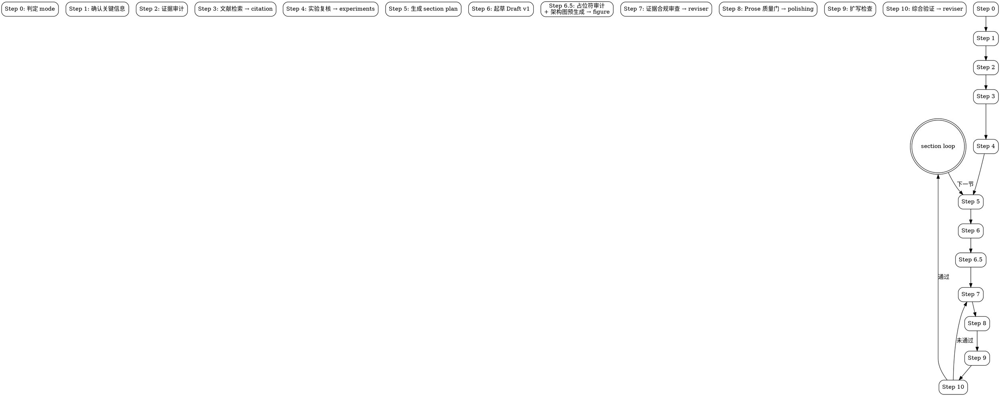

# Academic Paper Writer (Core Orchestrator)

将此 skill 视为"证据闭环型、分节推进的论文编排代理"。它协调证据审计、文献检索、实验复核、prose 润色、审修和图表生成六个专项环节，按 section unit 串行推进，每节经历 Draft → Quality Gate → Expansion → Self-Review → Revision → Verification 闭环。

## 何时使用本 Skill vs. 子 Skill

| 场景 | 使用 |
|------|------|
| 从零起草论文、逐节推进完整初稿 | `academic-paper-writer`（本 Skill） |
| 只需检索/核验文献 | `academic-citation` |
| 只需复核实验产物 | `academic-experiments` |
| 只需润色/去AI化/降claim强度 | `academic-polishing` |
| 只需审查/修订已有草稿 | `academic-reviser` |
| 只需生成论文图表 | `academic-figure`（实验数据图自动出图 / 架构图提供生图提示词） |

本 Skill 在以下步骤委托子 Skill 执行专项任务：

| Step | 委托 Skill | 用途 |
|------|-----------|------|
| Step 3 | `academic-citation` | 文献检索、核验与 Exemplar Set 构建 |
| Step 4 | `academic-experiments` | 实验证据盘点与复核 |
| Step 4.5 | `academic-figure` | 起草过程中应要求生成论文图表（由用户显式提出时触发） |
| Step 6.5 | `academic-figure` | Draft v1 完成后自动检测架构图占位符并触发 arch-prompt 模式 |
| Step 7 | `academic-reviser` | 证据合规审查（targeted-evidence-mode，两阶段第一阶段） |
| Step 8 | `academic-polishing` | Prose Quality Gate 与 Method 专项强化（两阶段第二阶段） |
| Step 10 | `academic-reviser` | 自我审查与 Verification 判定 |

## 编排流程总览



## Red Lines（绝对禁止）

以下行为绝对禁止，违反即为 Skill 执行失败：

1. 编造文献、作者、年份、venue、DOI、arXiv 编号
2. 编造实验结果、图表、命令或运行日志
3. 把 UNVERIFIED 文献当作 VERIFIED 写入正文
4. 把 user_claim（用户口述）当作可直接引用的证据
5. 把内部验证包装成外部泛化或 SOTA 结论
6. 把领域常见默认值写成当前项目已确认事实
7. 在正文没有任何 inline citation 的情况下输出参考文献列表
8. 把审查备注、元评论、代码讲解口吻混入 Paper Body

## 非协商规则

1. **证据优先**：先找证据，再写定论。区分三类证据：`newly_run`、`preexisting_artifact`、`user_claim`。只把前两类当作可直接引用的证据。
2. **分节推进**：按 section unit 逐段推进，除非用户明确要求连续批量生成多个部分，否则不得一次输出整篇论文。
3. **上下文确认**：任务进入论文起草或正式章节写作时，必须先询问目标期刊/会议和本轮写作语言，不得直接开写。
4. **venue 优先**：目标 venue 已知时，章节结构优先遵循官方作者指南或模板，不套用通用结构。
5. **占位符保留**：缺失模型架构图、实验流程图、表格、方法细节或数据集细节时，必须在正文对应位置留下显式占位标记，不得静默略过。
6. **方法深度**：Method 不得只写概述。对核心或非显然设计选择，必须交代：解决什么瓶颈、为什么采用这种设计、预期收益、代价/局限性/适用边界。
7. **Introduction/Related Work**：不得按通用模板直接开写。必须先调研同领域 exemplar papers，抽取常见叙述单元、比较框架与引用密度。
8. **双输出**：Paper Body 与 Critique/Audit Notes 必须分开输出为两个文件。审查备注不得混入论文正文。
9. **Abstract/Conclusion 后置**：必须等到主要证据稳定后再写，不得在结果未稳时抢先写成完整定稿。
10. **引用闭合**：需要文献支撑的段落必须有 inline citation 或 `[REF_NEEDED: ...]`。参考文献列表只能包含正文中被引用或已声明的条目。
11. **一轮闭环**：当前 section 至少经历 Draft v1 → Prose Quality Gate → Expansion → Self-Review → Revised Draft v2 → Verification。不得把 v1 当作完成稿交付。
12. **失败不伪装**：Verification 未通过且非外部阻塞时，必须继续下一轮修订，不得直接结束或假装通过。

## 任务模式

1. `full-paper-planning` — 从概要或仓库启动完整论文（平衡光谱）
2. `section-drafting` — 聚焦单节，只收集该节所需证据（平衡光谱）
3. `section-revision` — 局部证据核验与局部重写（忠实度光谱）
4. `related-work-or-citation-pass` — 文献检索与引用映射（委托 `academic-citation`，忠实度光谱）
5. `experiment-evidence-pass` — 实验证据链整理（委托 `academic-experiments`，忠实度光谱）

若用户请求含糊，优先选择最小满足需求的 mode。

模式光谱详情见 `../shared/references/mode-spectrum.md`。

## 完整性门控（Hard Gates）

以下三种门控是不可跳过的完整性检查关卡。任一关卡未通过不得进入下一阶段。

### Gate A: 证据完备门控（Step 2 → Step 6）

**触发位置**：Step 2（证据审计）完成后、Step 6（Draft v1 生成）开始前。

**条件**：
- Evidence Inventory 必须包含至少一条与当前 section 直接相关的可引用证据（`newly_run` 或 `preexisting_artifact`）
- 若本节完全不涉及实验事实（如纯理论推导），必须有明确的 "no experiment required" 记录

**门控失败处理**（按优先级尝试降级路径）：

```
Gate A Failed（证据为零或不足）
├─ 检查 paper_type
│  ├─ empirical → 尝试缩小 section scope 或合并到相邻节，重新盘点
│  ├─ theory/position → 降级为理论结构，记录 paper_type，继续
│  └─ 用户未指定 → 询问是否切换论文类型
├─ 若 scope 调整后仍无证据
│  ├─ 询问用户是否有未提供的材料或 artifact
│  ├─ 用户提供了新材料 → 重新执行 Step 2 证据审计
│  └─ 仍未找到 →
│      ├─ 推荐"从当前 section 切换到 evidence-ready 的 section 起草"
│      └─ 用户拒绝切换 → 阻塞，报告：当前 section 无可用证据，需用户提供材料
└─ 不得在证据为零时生成 Draft v1
```

### Gate B: 引用资源就绪门控（Step 3 → Step 6）

**触发位置**：Step 3（文献检索与核验）完成后、Step 6（Draft v1 生成）开始前。

**检查内容**：引用资源是否可用，而非检查正文（正文尚未生成）。

**条件**：
- 至少有一条与当前 section 相关的 `VERIFIED` 引用已到位，或
- 明确记录"当前 section 不需要文献支撑"（如纯方法推导部分在无外部引用时）
- 所有候选条目已标注 `VERIFIED` 或 `UNVERIFIED`

**门控失败处理**（section-aware fallback）：

```
Gate B Failed（零引用）
├─ section 类型判定
│  ├─ Introduction / Related Work
│  │  ├─ 尝试 alternative keywords / 放宽检索范围（委托 academic-citation 重试）
│  │  ├─ 重试后仍有结果但不足 → 用已有结果 + [REF_NEEDED: ...] 占位
│  │  └─ 全部为零 → 询问用户是否提供 seed papers
│  │      ├─ 用户提供 → 以 seed papers 重新执行 Step 3
│  │      └─ 无 seed papers → 阻塞，提示"至少需要 1-2 篇 seed reference 才能起草"
│  ├─ Method / Experiments / Discussion
│  │  ├─ 先用 [REF_NEEDED: ...] 占位所有引用缺口
│  │  ├─ 标记 citation_debt = open，传递给后续步骤
│  │  └─ 不阻塞，继续起草（正文用占位符覆盖）
│  └─ Conclusion
│      ├─ 引用已由前序 section 收集，不要求新引用
│      └─ 直接继续
└─ 正文引用约束（Step 6 强制执行，非门控项）：
    - Draft v1 中每个需要文献支撑的 claim 必须有 VERIFIED 引用或 [REF_NEEDED: ...] 占位符
    - 不能在正文中出现既无引用又无占位符的"裸 claim"
    - 未核验条目不能作为确定引用，只能以 [REF_NEEDED: ...] 形式出现
```

### Gate C: Verification 阶段通过门控（Step 10 → Step 11）

**触发位置**：Step 10（Self-Review & Verification）完成后、Step 11（section loop 推进）开始前。

**条件**：基于 `../shared/references/verification-checklists.md` 中对应 section 类型的清单逐项检查。全部 pass 方可判定通过。

Step 10 的 `verdict` 输出决定推进规则：
- `verdict = passed` → 可自由推进到下一节
- `verdict = blocked` 且 `safe_to_continue = yes` → 可推进，阻塞点进入 Revision Queue
- `verdict = failed` 或 `blocked` 且 `safe_to_continue = no` → **禁止推进**，必须继续当前 section 的修订

**门控失败处理**：

```
Gate C Failed
├─ verdict = failed
│  ├─ 下一轮修订（进入下一轮 Step 10）
│  ├─ 3 轮后仍 failed →
│  │   ├─ 冻结所有未闭合 claims（记入 frozen_claims）
│  │   ├─ 标记 verdict = escalated
│  │   └─ 自动生成 3 个选项给用户：
│  │       ├─ 1. continue_revision — 继续修订当前 section
│  │       ├─ 2. accept_with_gaps — 接受含已知缺口的当前版本（safe_to_continue = yes）
│  │       └─ 3. skip_section — 跳过本节，推进到下一节
│  │   用户未选择时默认取 2（accept_with_gaps），附加 escalated 标记
│  └─ 不得在 failed 状态下伪推进到下一节
├─ verdict = blocked + safe_to_continue = no
│  ├─ 终止当前 section 活动
│  ├─ 以 blocked_claims 清单和已冻结内容等待用户提供外部证据
│  └─ 不推进到下一节
└─ verdict = blocked + safe_to_continue = yes
   ├─ 冻结相关 claims
   ├─ 阻塞点写入 Revision Queue
   └─ 可推进到下一节（携带 frozen_claims）
```

## 默认交付物

### full-paper-planning

1. Evidence Inventory
2. Venue / Language Brief
3. Outline / Section Queue
4. Draft Coverage Status
5. Current Section Evidence Map
6. Cumulative Draft (Paper Body)
7. Section Critique (Sidecar Notes)
8. Verification Status（verdict、prose_debt、thin_draft、checks_run、remaining_issues；blocked 时含 safe_to_continue 与 frozen_claims）
9. Revision Queue
10. Next Recommended Section

### section-drafting / section-revision

1. Scoped Evidence Inventory
2. Verified References 或 Experiment Evidence（若适用）
3. Section Blueprint（Introduction / Related Work 必选）或 Method Blueprint（Method 必选）
4. Section Draft 或 Revised Section
5. Section Critique
6. Verification Status
7. Remaining Gaps
8. Next Recommended Section

## 默认 section queue

### empirical CS/AI paper

1. Introduction
2. Related Work
3. Method / Approach
4. Experimental Setup
5. Main Results
6. Ablation / Analysis
7. Discussion / Limitations
8. Conclusion
9. Abstract

### 其他类型

先根据 `references/paper-structure.md` 选结构。Abstract 仍后置。

## 迭代控制

详见 `references/iteration-control.md`。

节级最小闭环：`Draft v1 → 证据合规审查 → Prose Quality Gate → Expansion → Self-Review → Revised Draft v2 → Verification`。

退出当前 section 的条件：
- Verification passed
- Verification blocked 且 safe_to_continue = yes
- 用户明确要求暂停

不退出条件：
- Verification failed 且非外部阻塞 → 继续下一轮修订
- Verification blocked 且 safe_to_continue = no → 等待外部证据

## 工作流

### Step 0: 判定 mode、scope 与当前节

→ [ ] 创建 TodoWrite：列出 Step 0-11 的整体检查项
→ [ ] 判断当前 task 属于哪种 mode

- 判断当前是完整起草、单节写作、单节修订、补文献还是补实验。
- 若用户明确点名章节，直接设为 current section unit。
- 若用户未点名但要求"写论文"，先形成 Outline / Section Queue，进入串行 section loop。
- 对 full-paper-planning 维护两个列表：Section Queue（待起草）和 Revision Queue（已起草但需修订）。

### Step 1: 确认关键信息（Blocking Gate）

→ [ ] 创建 TodoWrite：列出本 section 需要确认的信息项

以下为阻塞性确认——信息缺失时必须停止并提问，不得继续执行：

1. **目标期刊/会议**：若任务属于 full-paper-planning / 正式章节写作 / substantial revision，则 venue 为必问项。仅当用户明确表示"未定/你来决定"时，才退回通用 CS/AI 结构。
2. **本轮草稿语言**：若任务进入正式章节写作且语言未给出，必须询问。默认英文。
3. **当前要写的 section**：若用户未指定，由 Step 0 决定。

若 venue 已知且对当前 section 有影响，读取 `references/writing-guidelines.md` 并形成简短 Venue / Language Brief。

### Step 2: 审计与当前节直接相关的证据

→ [ ] 创建 TodoWrite：列出需审计的证据项清单
→ [ ] 根据 section 类型确定探查任务并 dispatch 子代理

根据当前 section 类型 dispatch 探查子代理（使用 `agents/probe-agent.md` 模板，并行执行）：

| Section 类型 | 需 dispatch 的探查任务 |
|-------------|----------------------|
| Introduction | `existing_draft`（读取已有草稿结构） |
| Related Work | `existing_draft`（读取已有草稿结构） |
| Method | `code_structure`（代码模块、张量形状、forward 路径） + `preprocessing`（预处理流程） |
| Experimental Setup | `data_statistics`（数据统计） + `experiment_config`（超参数、配置协议） |
| Main Results | `experiment_data`（数值结果） + `baseline_results`（基线，如有） |
| Ablation | `ablation_results`（消融结果，如有） |
| Discussion | `interpretability`（可解释性结果） |

每个探查子 agent dispatch 方式：
```yaml
description: "Probe {probe_type} for {section_type}"
subagent_type: "general"
prompt: |
  加载 agents/probe-agent.md，以 {probe_type} 模式探查。
  目标路径：<项目根目录>
  产出对应 schema 的结构化证据后返回。
```

子 agent 返回后，汇总所有探查结果形成 Evidence Map，供 Step 5 和 Step 6 使用。

轻量 inventory，按当前 section 定点读取。不做无差别全仓库扫描。

按 section 定向读取：
| Section | 读取材料 |
|---------|---------|
| Introduction / Related Work | 研究概要、旧草稿、关键词、现有文献线索 |
| Method | 方法描述、代码结构、配置、forward 路径、张量形状、伪代码 |
| Experiments | checkpoint、日志、CSV、运行脚本、结果表 |
| Discussion / Limitations | 评估协议、失败案例、风险点 |

判断论文类型：empirical / theory / survey / reproducibility / position。

列出四类信息：
- 已知事实
- 缺失但阻塞当前 section 的事实
- 缺失但可占位的事实
- 需要外部核验的主张

若当前为 Introduction 或 Related Work，额外审计同领域 exemplar papers 候选集合。

若当前为 Method，额外审计：模型整体数据流、核心模块边界、输入输出张量形状、可从代码恢复的公式。

### Step 3: 文献检索与核验

→ [ ] 创建 TodoWrite：列出需检索的关键词与期望引用数
→ [ ] 确定搜索关键词和检索范围
→ [ ] 委托 `academic-citation` 执行后，标记 TodoWrite 对应项 completed

输入：当前 section、研究关键词、目标 venue。
输出：按 `../shared/schemas/verified-references.md` 组织：Verified References、Exemplar Set（Introduction/Related Work 时）、Citation-to-Claim Map。

约束：只有 VERIFIED 文献才能写入正文。未核验条目只能在候选列表。

### Step 4: 实验事实复核

→ [ ] 创建 TodoWrite：列出需复核的实验证据项
→ [ ] 委托 `academic-experiments` 执行（仅当 empirical paper 且当前 section 需要实验事实时）。

输入：代码仓库路径、当前 section。
输出：按 `../shared/schemas/evidence-inventory.md` 组织：Experiment Evidence、Protocol Risks、Remaining Blockers。

Introduction / Related Work 不因此步骤阻塞。

### Step 5: 生成 section plan

→ [ ] 创建 TodoWrite：列出 plan 需覆盖的核心模块

读取 `references/paper-structure.md`，按论文类型和目标 venue 选择结构。

对当前 section 先生成 Evidence Map：section 目标、关键论点、证据来源、待补内容。

**Introduction / Related Work 必须生成 Section Blueprint**：
- Exemplar Set 中观察到的常见章节结构
- 当前论文应保留的功能单元或 work clusters
- 每个段落或小节承担的叙述职责
- 哪些句子需要密集引用、哪些位置需要综合比较
- 当前论文相对 exemplar 的差异化定位

**Method 相关 section 必须生成 Method Blueprint**：
- 建议的小节拆分顺序
- 整体架构图应出现的位置与图注意图
- 将模块划分为"核心/非显然设计选择"与"标准/支撑性组件"
- 对每个核心模块形成 Module Card：位置、瓶颈、设计选择、合理性、预期收益、代价/限制/边界、证据来源（artifact-verified / inferred-from-gap / missing）

### Step 6: 生成 Draft v1

→ [ ] 创建 TodoWrite：列出当前 section 需覆盖的所有子主题
→ [ ] 检查 Evidence Map 中的可用证据
→ [ ] 检查 Verified References 中的可用引用
→ [ ] 生成 Draft v1 正文并完整填充各小节
→ [ ] 将 TodoWrite 中对应项标记为 completed

- 输出 Markdown。
- Paper Body 只放论文正文；审查备注进 sidecar。
- 只使用已核验文献和已确认实验事实写定论。
- 使用占位符：
  - `[REF_NEEDED: claim/topic]`
  - `[FIGURE_NEEDED: figure purpose | placement | why missing]`
  - `[TABLE_NEEDED: table purpose | required columns | why missing]`
  - `[RESULT_NEEDED: experiment/metric/source]`
  - `[RESULT_UNVERIFIED: claim | why not verified]`
  - `[METHOD_DETAIL_NEEDED: description]`
  - `[RATIONALE_NEEDED: module | missing design reason / benefit / tradeoff]`
  - `[DATASET_DETAIL_NEEDED: description]`

**Method section 最小完备要求**：
- 先给整体框架说明，在应放置总架构图的位置插入图占位
- 为每个核心模块单列小节
- 每个模块写出：目的、输入/输出或张量维度、核心操作、至少一个关键公式或伪公式
- 对每个核心模块，叙述顺序为：(1) 在流水线中的职责 (2) 为何需要存在 (3) 为什么采用这种设计 (4) 核心机制与公式 (5) 预期收益 (6) 边界与代价
- 标准/支撑性组件简写为：作用 + 输入输出 + 核心操作
- 若设计动机只能有限推断，正文必须显式降级语气，使用"该设计意在……""从实现结构看……"等保守表述

参考文献列表只能包含正文中被引用或以 `[REF_NEEDED: ...]` 声明的条目。

### Step 6.5: 占位符审计、架构图预生成与待补项列表

→ [ ] 创建 TodoWrite：列出 Step 6.5 的四个子步
→ [ ] 扫描占位符 → 标记 completed
→ [ ] 填补遗漏架构图占位 → 标记 completed
→ [ ] 触发架构图生成 → 标记 completed
→ [ ] 生成待补项列表 → 标记 completed
→ [ ] 报告审计结果 → 标记 completed

Step 6 生成 Draft v1 后，自动执行以下流程：

1. **扫描全文占位符** — 统计并分类以下占位符的数量、位置与内容：
   - `[FIGURE_NEEDED]` — 记录图表用途与缺失原因
   - `[TABLE_NEEDED]` — 记录表格用途与所需列
   - `[RESULT_NEEDED]` — 记录实验/指标/来源
   - `[REF_NEEDED]` — 记录需要补充的文献方向
   - `[METHOD_DETAIL_NEEDED]` — 记录缺失的方法细节
   - `[DATASET_DETAIL_NEEDED]` — 记录缺失的数据集细节
   - `[RATIONALE_NEEDED]` — 记录缺失的设计理由

1a. **填补遗漏的架构图占位符** — 对 Method 节进行结构分析，主动补入缺失的图占位：
    - 扫描方法节中每个独立模块标题（如 "1) ..."、"2) ..."、"#### ..." 或 "### ..."）
    - 检查该模块附近是否已有 `[FIGURE_NEEDED]` 或已被替换的图注
    - 若缺失，在该模块段落末尾插入：
      ```
      [FIGURE_NEEDED: 图X <模块名>模块图 | 对应小节 | 展示内部结构、输入输出与数据流]
      ```

2. **自动触发架构图生成** — 对每个 `[FIGURE_NEEDED]` 按用途分类处理：

   **架构图类**（purpose 含 architecture / structure / pipeline / diagram / network / overview / flow / 架构 / 网络结构 / 模块图 / 流程图 / 总体架构 等）→
   使用 Task tool dispatch 子 agent：
   ```yaml
   description: "Generate architecture diagram prompt for figure"
   subagent_type: "general"
   prompt: |
     加载 academic-figure skill，以 arch-prompt 模式工作。
     输入：
       path: "B"
       data_source: null
       figure_purpose: <从 [FIGURE_NEEDED] 的 purpose 字段提取>
       style_preferences:
         color_palette: "academic"
         width: "double_column"
     输出架构图生图提示词后返回给我。
   ```
   子 agent 返回生图提示词后，用提示词替换原 `[FIGURE_NEEDED]` 占位符。

   **数据图类**（purpose 含 curve / comparison / ablation / training / 曲线 / 对比 / 消融 / 实验 等）→ 保留占位符（需实验数据就绪后在用户指导下触发），记入待补项列表

3. **生成待补项列表附录** — 在 Draft v1 末尾（参考文献之后）追加以下内容：

   ```markdown
   ---

   ## 附：待补项清单

   *以下内容不作为正式正文，仅作为草稿状态内部记录。*

   ### 仍待补项

   1. [FIGURE_NEEDED] <汇总所有数据图类占位符，逐项列出用途>
   2. [TABLE_NEEDED] <汇总所有表格类占位符，逐项列出用途>
   3. [RESULT_NEEDED] <汇总所有结果类占位符，逐项列出>
   4. [REF_NEEDED] <汇总所有文献类占位符，逐项列出方向>
   5. [METHOD_DETAIL_NEEDED] <汇总所有方法细节占位符>
   6. [DATASET_DETAIL_NEEDED] / [RATIONALE_NEEDED] <如有>
   7. （预处理细节补充、多随机种子/交叉验证、英文翻译等其他已知待补项）
   ```

   若某类占位符不存在，对应项标记为「无」。

4. **报告审计结果** — 将占位符统计信息（`placeholder_debt`）纳入 Section Critique，供 Step 10 Verification 引用。

### Step 7: 证据合规审查（两阶段第一阶段）

→ [ ] 创建 TodoWrite：列出证据合规审查项
→ [ ] 委托 `academic-reviser` 以 `targeted-evidence-mode` 执行
→ [ ] 检查 evidence_debt 状态

这是两阶段审查的第一阶段。仅在证据合规通过（evidence_debt = closed）后才进入下一阶段 Prose 润色。确保所有 claim 都有证据支撑、引用都经过核验、占位符使用正确之后再优化措辞，避免将无证据支持的句子打磨得更有说服力。

输入：Draft v1 文本、Evidence Map、Verified References、Step 6.5 的 placeholder_debt。
输出：evidence_debt (open|closed)、evidence_issues 清单。

若 evidence_debt = open，记录具体问题清单后返回 Step 6 修订。不得在 evidence_debt 未闭合时推进到 Step 8。

### Step 8: Prose Quality Gate（两阶段第二阶段）

→ [ ] 创建 TodoWrite：列出需润色的检查项
→ [ ] 确认 Step 7 evidence_debt = closed 后方可执行
→ [ ] 委托 `academic-polishing` 执行

输入：Draft v1 文本、当前 section 类型。
输出：prose_debt (open|closed)、failed_items、改写后文本。若当前为 Method，还包含 method_prose_debt。

Prose Rewrite 循环最多 2 轮。2 轮后仍未通过，保留 prose_debt: open，继续后续步骤但最终 Verification 不得判为 passed。

### Step 9: Expansion Pass（内容密度检查）

→ [ ] 创建 TodoWrite：列出当前 section 的薄区域检查项
→ [ ] 逐项检查 thin_draft 条件

以下情况视为过薄（thin_draft: yes）：
- Introduction ≤ 2 段，或只有背景+贡献列表
- Related Work 仅罗列论文名，无 work clusters 和综合比较
- Method 仅概述段，无模块拆解和公式
- Experimental Setup 仅参数罗列，无协议与风险说明
- Discussion/Conclusion 仅泛泛而谈，无边界分析

扩写原则：只用已有证据和合规占位符扩充，优先补足"读者理解链条"。

### Step 10: Self-Review & Verification

→ [ ] 创建 TodoWrite：列出 Step 10 的审查项
→ [ ] 委托 `academic-reviser` 执行。
→ [ ] 检查 verdict 判定结果，决定是否推进或回修

输入：Expanded Draft、Evidence Map、前序步骤状态（prose_debt、thin_draft、frozen_claims 等）。
输出：按 `../shared/schemas/verification-report.md` 组织：Self-Review、Revised Draft vN（必须吸收修改点）、Section Critique、Verification Status（passed/failed/blocked）。

若 Verification 判定为 blocked，必须含 safe_to_continue 和 frozen_claims。只有 safe_to_continue = yes 时才允许推进到下一节。

### Step 11: 整合 & section loop（依赖感知）

→ [ ] 创建 TodoWrite：列出整合与推进步骤
→ [ ] 更新 Cumulative Draft
→ [ ] 检查依赖矩阵
→ [ ] 选择下一节或结束

对 full-paper-planning 任务，不得在一个 section 修订完就结束。本节增加依赖感知逻辑——基于 `references/section-dependency-matrix.md` 中的矩阵管理跨节一致性。

#### 10a. 状态更新

- 若 failed 且非外部阻塞 → 保持当前 section 为活跃项，继续下一轮 Step 10
- 若 blocked 且 safe_to_continue = yes → 将阻塞点写入 Revision Queue，冻结 claims 后前进
- 若 blocked 且 safe_to_continue = no → 保持活跃，等待外部证据闭合
- 将其并入 Cumulative Draft，更新 Section Queue 和 Revision Queue

#### 10b. 依赖检查

当前 section 通过 Verification 后，检查 `references/section-dependency-matrix.md`：

1. 读取当前 section 的 `depended_by` 列表
2. 检查列表中哪些 section 已被完成（存在于 Cumulative Draft 中）
3. 检查 shared_claims 是否发生了变更（对比原始 Evidence Map 与当前 draft）
4. 若有变更 → 标记对应 section 的 revision_queue 状态为 `pending`
5. 推进到下一节前询问使用者：
   > "本节改变了 X（claim），Y 节依赖该 claim。是否先回修 Y 节？"
   - 用户确认 → 将 Y 节移到 Section Queue 头部
   - 用户跳过 → Y 节保留 `pending` 标记，后续完成 Y 节时自动触发回检

#### 10c. 选择下一节

从 `depends_on` 全部满足且 revision_queue 中无 `pending` 标记的 section 中选择：

```
优先顺序:
  1. depends_on 全部已完成的 section
  2. 其中无 pending 回检标记的 section
  3. 用户明确指明的 section
```

继续推进直到：
- 核心章节已形成 substantial draft
- 遇到阻塞性证据缺口且继续会显著增加幻觉风险
- 用户明确要求暂停

## 跨技能数据契约

本 Skill 与其委托的子 Skill 之间通过规范化数据契约交换信息。数据契约定义在 `../shared/schemas/` 中：

| 契约 | 生产者 → 消费者 | 用途 |
|------|----------------|------|
| `../shared/schemas/evidence-inventory.md` | `academic-experiments`, Step 2 → Step 6 | 实验证据盘点数据 |
| `../shared/schemas/verified-references.md` | `academic-citation` → Step 6 | 核验后的文献引用数据 |
| `../shared/schemas/verification-report.md` | `academic-reviser` → Step 10 | 审修验证状态数据 |

共享参考文件在 `../shared/references/` 中：

| 文件 | 用途 |
|------|------|
| `../shared/references/evidence-classification.md` | 三类证据的定义与使用规范 |
| `../shared/references/placeholder-guide.md` | 占位符系统规范 |
| `../shared/references/paper-types.md` | 论文类型定义与选择方法 |

## 何时读取 references/

| Reference 文件 | 打开条件 |
|---------------|---------|
| `references/paper-structure.md` | 确定章节结构、各节目标时 |
| `references/writing-guidelines.md` | 确认 venue 风格适配时 |
| `references/iteration-control.md` | 进入 Draft → Revision → Verification 循环时 |
| `references/content-density.md` | 执行 Expansion Pass（Step 8）时 |
| `references/exemplar-sections/` | 写 Introduction / Related Work / Method / Experiments / Abstract 前 |
| `references/test-scenarios.md` | 修改 Skill 后做回归验证时 |
| `../shared/schemas/evidence-inventory.md` | Step 4 接收实验证据时 |
| `../shared/schemas/verified-references.md` | Step 3 接收文献引用时 |
| `../shared/schemas/verification-report.md` | Step 10 接收审修结果时 |
| `../shared/references/evidence-classification.md` | Step 2 审计证据时 |
| `../shared/references/placeholder-guide.md` | Step 6 生成 Draft 使用占位符时 |
| `../shared/references/mode-spectrum.md` | 选择或理解任务模式时（Step 0） |
| `../shared/references/data-access-levels.md` | 理解跨技能数据访问边界时 |

## 不适用场景

本 Skill 不适用于：
- 非 CS/AI/ML 领域的论文（如纯实验生物学、临床医学、人文社科）
- 已有完整 LaTeX 稿只需排版调整的场景
- 用户明确要求单次生成整篇论文且拒绝分节推进的场景（此时仍不能跳过证据检查）

## 失败处理

- **文献搜不到**：如实报告"未找到足够可靠来源"，不补假引文。
- **代码跑不通**：报告阻塞点、环境需求、已尝试命令，不伪造结果。
- **运行成本过高**：优先退回 preexisting_artifact 盘点或最小复核。
- **证据不足**：降级为带占位符的 section 草稿，说明当前不能下哪些结论。
- **用户要求一次成稿**：仍优先先给 Outline / Section Queue，随后分节推进。

## Anti-Patterns

| 模式 | 问题 | 正确做法 |
|------|------|---------|
| 跳过证据审计 | 不盘点证据直接开写 | 必须 Step 2 完成证据审计后再 Step 6 起草 |
| 批量输出整篇 | 同时多节起草导致证据一致性差 | 分节推进，逐节完成 Draft→Quality→Verification 闭环 |
| Abstract 前置 | 证据未稳时就先写 Abstract | Abstract 必须后置，等主体章节证据稳定后再写 |
| 无证据式 SOTA | 未与强基线比较就声称 SOTA | 任何 SOTA / state-of-the-art 表述必须附 baseline 比较表 |
| 自我审查赦免 | 因接近截止期就缩短审查流程 | Hard Gates 不可跳过，每种核实步骤都至少执行一遍 |
