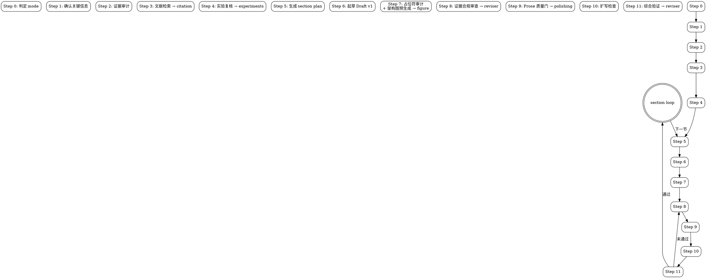

# Academic Paper Writer (Core Orchestrator)

将此 skill 视为"证据闭环型、分节推进的论文编排代理"。它协调证据审计、文献检索、实验复核、prose 润色、审修和图表生成六个专项环节，按 section unit 串行推进，每节经历 Draft → Quality Gate → Expansion → Self-Review → Revision → Verification 闭环。

## 何时使用本 Skill vs. 子 Skill

| 场景 | 使用 |
|------|------|
| 从零起草论文、逐节推进完整初稿 | `academic-paper-writer`（本 Skill） |
| 只需检索/核验文献 | `academic-citation` |
| 只需复核实验产物 | `academic-experiments` |
| 只需润色/去AI化/降claim强度 | `academic-polishing` |
| 只需审查/修订已有草稿 | `academic-reviser` |
| 只需生成论文图表 | `academic-figure`（实验数据图自动出图 / 架构图提供生图提示词） |

本 Skill 在以下步骤委托子 Skill 执行专项任务：

| Step | 委托 Skill | 用途 |
|------|-----------|------|
| Step 3 | `academic-citation` | 文献检索、核验与 Exemplar Set 构建 |
| Step 4 | `academic-experiments` | 实验证据盘点与复核 |
| 用户显式触发 | `academic-figure` | 起草过程中应要求生成论文图表 |
| Step 7 | `academic-figure` | Draft v1 完成后自动检测架构图占位符并触发 arch-prompt 模式 |
| Step 8 | `academic-reviser` | 证据合规审查（targeted-evidence-mode，两阶段第一阶段） |
| Step 9 | `academic-polishing` | Prose Quality Gate 与 Method 专项强化（两阶段第二阶段） |
| Step 11 | `academic-reviser` | 自我审查与 Verification 判定 |

## 编排流程总览

## Red Lines（绝对禁止）

以下行为绝对禁止，违反即为 Skill 执行失败：

1. **主 Agent 只撰写论文文本，绝对不得修改项目源代码、配置文件或数据文件**。探查时只读，图表代码生成时创建新文件而非覆盖现有文件。
2. 编造文献、作者、年份、venue、DOI、arXiv 编号
3. 编造实验结果、图表、命令或运行日志
4. 把 UNVERIFIED 文献当作 VERIFIED 写入正文
5. 把 user_claim（用户口述）当作可直接引用的证据
6. 把内部验证包装成外部泛化或 SOTA 结论
7. 把领域常见默认值写成当前项目已确认事实
8. 在正文没有任何 inline citation 的情况下输出参考文献列表
9. 把审查备注、元评论、代码讲解口吻混入 Paper Body

## 非协商规则

1. **证据优先**：先找证据，再写定论。区分三类证据：`newly_run`、`preexisting_artifact`、`user_claim`。只把前两类当作可直接引用的证据。
2. **分节推进**：按 section unit 逐段推进，除非用户明确要求连续批量生成多个部分，否则不得一次输出整篇论文。
3. **上下文确认**：任务进入论文起草或正式章节写作时，必须先询问目标期刊/会议和本轮写作语言，不得直接开写。
4. **venue 优先**：目标 venue 已知时，章节结构优先遵循官方作者指南或模板，不套用通用结构。
5. **占位符保留**：缺失模型架构图、实验流程图、表格、方法细节或数据集细节时，必须在正文对应位置留下显式占位标记，不得静默略过。
6. **方法深度**：Method 不得只写概述。对核心或非显然设计选择，必须交代：解决什么瓶颈、为什么采用这种设计、预期收益、代价/局限性/适用边界。
7. **Introduction/Related Work**：不得按通用模板直接开写。必须先调研同领域 exemplar papers，抽取常见叙述单元、比较框架与引用密度。
8. **双输出**：Paper Body 与 Critique/Audit Notes 必须分开输出为两个文件。审查备注不得混入论文正文。
9. **Abstract/Conclusion 后置**：必须等到主要证据稳定后再写，不得在结果未稳时抢先写成完整定稿。
10. **引用闭合**：需要文献支撑的段落必须有 inline citation 或 `[REF_NEEDED: ...]`。参考文献列表只能包含正文中被引用或已声明的条目。
11. **一轮闭环**：当前 section 至少经历 Draft v1 → Prose Quality Gate → Expansion → Self-Review → Revised Draft v2 → Verification。不得把 v1 当作完成稿交付。
12. **失败不伪装**：Verification 未通过且非外部阻塞时，必须继续下一轮修订，不得直接结束或假装通过。
13. **完整流程执行**：执行 full-paper-planning 时，必须按 Step 0→1→2→...→12 的顺序逐一执行，不得跳步。用户催促时也不得跳过证据审计（Step 2）、文献检索（Step 3）、实验复核（Step 4）、Hard Gates（A/B/C）中的任何一个。

## 任务模式

1. `full-paper-planning` — 从概要或仓库启动完整论文（平衡光谱）
2. `section-drafting` — 聚焦单节，只收集该节所需证据（平衡光谱）
3. `section-revision` — 局部证据核验与局部重写（忠实度光谱）
4. `related-work-or-citation-pass` — 文献检索与引用映射（委托 `academic-citation`，忠实度光谱）
5. `experiment-evidence-pass` — 实验证据链整理（委托 `academic-experiments`，忠实度光谱）

若用户请求含糊，优先选择最小满足需求的 mode。

除纯 pass-through 模式（如 `related-work-or-citation-pass`、`experiment-evidence-pass`）外，所有起草/修订模式都必须执行同一组 Hard Gates 与 Step 0 → 12 闭环；`section-drafting` 只是缩小证据范围，不缩短流程。

模式光谱详情见 `../shared/references/mode-spectrum.md`。

## 完整性门控（Hard Gates）

以下三种门控是不可跳过的完整性检查关卡。任一关卡未通过不得进入下一阶段。

### Gate A: 证据完备门控（Step 2 → Step 6）

**触发位置**：Step 2（证据审计）完成后、Step 6（Draft v1 生成）开始前。

**条件**：
- Evidence Inventory 必须包含至少一条与当前 section 直接相关的可引用证据（`newly_run` 或 `preexisting_artifact`）
- 若本节完全不涉及实验事实（如纯理论推导），必须有明确的 "no experiment required" 记录

**失败处理摘要**：优先按 `paper_type`、section scope、用户补充材料、切换到 evidence-ready section 四类路径降级；若仍无证据，则阻塞，且不得在证据为零时生成 Draft v1。

**详细执行细则**：见 `references/orchestration-workflow.md` 中对应步骤的完整降级路径与阻塞规则。

### Gate B: 引用资源就绪门控（Step 3 → Step 6）

**触发位置**：Step 3（文献检索与核验）完成后、Step 6（Draft v1 生成）开始前。

**检查内容**：引用资源是否可用，而非检查正文（正文尚未生成）。

**条件**：
- 至少有一条与当前 section 相关的 `VERIFIED` 引用已到位，或
- 明确记录"当前 section 不需要文献支撑"（如纯方法推导部分在无外部引用时）
- 所有候选条目已标注 `VERIFIED` 或 `UNVERIFIED`

**失败处理摘要**：按 section 类型分流。Introduction / Related Work 优先重试检索或请求 seed papers；若仍无 VERIFIED 引用，则阻塞，**不得**仅靠 `[REF_NEEDED: ...]` 占位直接起草。Method / Experiments / Discussion 允许以 `[REF_NEEDED: ...]` 占位继续；Conclusion 默认复用前序 section 已收集的引用。

**正文约束**：Step 6 起草时，所有需要文献支撑的 claim 必须带 VERIFIED 引用或 `[REF_NEEDED: ...]` 占位，禁止出现既无引用又无占位的裸 claim。

**详细执行细则**：见 `references/orchestration-workflow.md` 中对应步骤的 section-aware fallback。

### Gate C: Verification 阶段通过门控（Step 11 → Step 12）

**触发位置**：Step 11（Self-Review & Verification）完成后、Step 12（section loop 推进）开始前。

**条件**：基于 `../shared/references/verification-checklists.md` 中对应 section 类型的清单逐项检查。全部 pass 方可判定通过。

**strict 判定摘要**：`passed` 仅在 `prose_debt`、`citation_debt`、`evidence_debt`、`figure_debt` 全部闭合且 `thin_draft = no` 时成立；否则只能是 `blocked` 或 `failed`，不得伪装为 passed。

**推进规则摘要**：
- `passed` → 可推进到下一节
- `blocked` 且 `safe_to_continue = yes` → 可推进，但必须冻结相关 claims 并写入 Revision Queue
- `blocked` 且 `safe_to_continue = no`，或 `failed` → 禁止推进，继续当前 section 修订或等待外部证据

**详细执行细则**：包括 escalated 分支、冻结 claims、默认用户选项与阻塞等待路径，统一见 `references/orchestration-workflow.md`。

## 默认交付物

### full-paper-planning

1. Evidence Inventory
2. Venue / Language Brief
3. Outline / Section Queue
4. Draft Coverage Status
5. Current Section Evidence Map
6. Cumulative Draft (Paper Body)
7. Section Critique (Sidecar Notes)
8. Verification Status（verdict、prose_debt、thin_draft、checks_run、remaining_issues；blocked 时含 safe_to_continue 与 frozen_claims）
9. Revision Queue
10. Next Recommended Section
11. **Citation-to-Claim Map**（整篇论文完成后统一生成，放置于论文末尾参考文献列表之后）

### section-drafting / section-revision

1. Scoped Evidence Inventory
2. Verified References 或 Experiment Evidence（若适用）
3. Section Blueprint（Introduction / Related Work 必选）或 Method Blueprint（Method 必选）
4. Section Draft 或 Revised Section
5. Section Critique
6. Verification Status
7. Remaining Gaps
8. Next Recommended Section

## 默认 section queue

### empirical CS/AI paper

1. Introduction
2. Related Work
3. Method / Approach
4. Experimental Setup
5. Main Results
6. Ablation / Analysis
7. Discussion / Limitations
8. Conclusion

**Abstract 为后置章节**，不在初始 Section Queue 中。仅在 Section Queue 全部完成且所有核心章节 Verification = passed 后才允许生成。在此之前，在占位符系统中使用 `[ABSTRACT_NEEDED: 待主要证据稳定后撰写]`。

### 其他类型

先根据 `references/paper-structure.md` 选结构。Abstract 仍后置。

## 迭代控制

详见 `references/iteration-control.md`。

节级最小闭环：`Draft v1 → 证据合规审查 → Prose Quality Gate → Expansion → Self-Review → Revised Draft v2 → Verification`。

退出当前 section 的条件：
- Verification passed
- Verification blocked 且 safe_to_continue = yes
- 用户明确要求暂停

不退出条件：
- Verification failed 且非外部阻塞 → 继续下一轮修订
- Verification blocked 且 safe_to_continue = no → 等待外部证据

## 工作流概要

详见 `references/orchestration-workflow.md` 获取每个步骤的完整执行细节。

| Step | 动作 | 委托 Skill | 触发方式 |
|------|------|-----------|---------|
| 0 | 判定 mode、scope、当前 section | — | 自动 |
| 1 | 确认 venue / 语言（Blocking Gate） | — | 自动 |
| 2 | 证据审计（dispatch probe agents） | — | 自动 |
| 3 | 文献检索与核验 | `academic-citation` | 自动 |
| 4 | 实验事实复核 | `academic-experiments` | 自动 |
| 5 | 生成 Section / Method Blueprint | — | 自动 |
| 6 | 起草 Draft v1（含占位符系统 + **待补项清单**） | — | 自动 |
| 7 | 占位符审计 + 架构图预生成 | `academic-figure`（arch-prompt） | 自动 |
| 8 | 证据合规审查（Phase 1） | `academic-reviser` | 自动 |
| 9 | Prose Quality Gate（Phase 2） | `academic-polishing` | 自动 |
| 10 | Expansion Pass（内容密度检查） | — | 自动 |
| 11 | Self-Review & Verification | `academic-reviser` | 自动 |
| 12 | 整合 & 依赖感知 section loop | — | 自动 |

**核心约束**：Draft v1 → Evidence Review → Prose Review → Expansion → Verification → Advance（或 Revise）。

**执行细则**：每个委托步骤的 Task dispatch 模板、输入输出格式、子步骤顺序与失败处理统一定义在 `references/orchestration-workflow.md`。执行时以该文件为唯一详细流程手册。

### Step 6 必附：待补项清单

Draft v1 生成后，**必须**在正文末尾（参考文献之后）追加待补项清单，作为 Draft v1 交付物的一部分。

**详细模板**：见 `references/orchestration-workflow.md` 中 Step 7d 的统一模板。若某类占位符不存在，对应项标记为「无」。

## 跨技能数据契约

本 Skill 与其委托的子 Skill 之间通过规范化数据契约交换信息。数据契约定义在 `../shared/schemas/` 中：

| 契约 | 生产者 → 消费者 | 用途 |
|------|----------------|------|
| `../shared/schemas/evidence-inventory.md` | `academic-experiments`, Step 2 → Step 6 | 实验证据盘点数据 |
| `../shared/schemas/verified-references.md` | `academic-citation` → Step 6 | 核验后的文献引用数据 |
| `../shared/schemas/verification-report.md` | `academic-reviser` → Step 11 | 审修验证状态数据 |

共享参考文件在 `../shared/references/` 中：

| 文件 | 用途 |
|------|------|
| `../shared/references/evidence-classification.md` | 三类证据的定义与使用规范 |
| `../shared/references/placeholder-guide.md` | 占位符系统规范 |
| `../shared/references/paper-types.md` | 论文类型定义与选择方法 |

## Agent 资源与执行架构

本 Skill 采用**主 Agent 一体化写作 + 工具型子代理辅助**的架构：

### 写作原则

- **论文正文（Introduction / Related Work / Method / Experiments / Discussion / Conclusion / Abstract）由主 Agent 直接撰写**，不 dispatch 独立写作子代理
- 这一设计确保全文叙事风格一致、术语统一、引用编号连续
- 子 Skill 的 `SKILL.md` 与 `agents/` 文件共同定义**工具型子代理**的职责边界与输出契约；主 Agent 按 `references/orchestration-workflow.md` 中的 dispatch 模板创建子代理并吸收其结果

### 可 dispatch 的子 Agent（工具型任务）

| 步骤 | 子 Skill | Agent 文件 | 任务类型 | 约束 |
|------|---------|-----------|---------|------|
| Step 2 | `academic-paper-writer` | `agents/probe-agent.md` | 只读探查（代码结构/实验数据/配置协议） | **只读，禁止修改任何项目文件** |
| Step 3 | `academic-citation` | `agents/citation_agent.md` | 文献检索与核验 | **只检索，禁止修改项目文件** |
| Step 4 | `academic-experiments` | `agents/experiment_agent.md` | 实验证据盘点与运行 | **可运行实验，禁止修改源代码/数据** |
| Step 7 | `academic-figure` | `agents/figure_agent.md` | 架构图提示词生成 | **只生成图表，禁止修改项目代码** |
| Step 8 | `academic-reviser` | `agents/reviser_agent.md` | 证据合规审查 | **只审查文本，禁止修改项目文件** |
| Step 9 | `academic-polishing` | `agents/polishing_agent.md` | Prose 润色与 claim 强度审计 | **只修改论文草稿，禁止修改项目文件** |
| Step 11 | `academic-reviser` | `agents/reviser_agent.md` | 综合验证判定 | **只审查文本，禁止修改项目文件** |

### 核心编排器的职责边界

- **主 Agent 负责**：制定 Section Blueprint、撰写 Draft v1、执行 Expansion Pass、整合 Cumulative Draft、生成 Abstract、维护跨节一致性
- **子 Agent 负责**：提供专项工具输出（探查结果 / 文献列表 / 实验数据 / 审修报告 / 润色建议 / 图表），供主 Agent 吸收进论文正文
- 子 Agent **不得**直接修改 Cumulative Draft 或生成独立章节文本

## 何时读取 references/

| Reference 文件 | 打开条件 |
|---------------|---------|
| `references/paper-structure.md` | 确定章节结构、各节目标时 |
| `references/writing-guidelines.md` | 确认 venue 风格适配时 |
| `references/iteration-control.md` | 进入 Draft → Revision → Verification 循环时 |
| `references/content-density.md` | 执行 Expansion Pass（Step 10）时 |
| `references/exemplar-sections/` | 写 Introduction / Related Work / Method / Experiments / Abstract 前 |
| `references/test-scenarios.md` | 修改 Skill 后做回归验证时 |
| `../shared/schemas/evidence-inventory.md` | Step 4 接收实验证据时 |
| `../shared/schemas/verified-references.md` | Step 3 接收文献引用时 |
| `../shared/schemas/verification-report.md` | Step 11 接收审修结果时 |
| `../shared/references/evidence-classification.md` | Step 2 审计证据时 |
| `../shared/references/placeholder-guide.md` | Step 6 生成 Draft 使用占位符时 |
| `../shared/references/mode-spectrum.md` | 选择或理解任务模式时（Step 0） |
| `../shared/references/data-access-levels.md` | 理解跨技能数据访问边界时 |

## 不适用场景

本 Skill 不适用于：
- 非 CS/AI/ML 领域的论文（如纯实验生物学、临床医学、人文社科）
- 已有完整 LaTeX 稿只需排版调整的场景
- 用户明确要求单次生成整篇论文且拒绝分节推进的场景（此时仍不能跳过证据检查）

## 失败处理

- **文献搜不到**：如实报告"未找到足够可靠来源"，不补假引文。
- **代码跑不通**：报告阻塞点、环境需求、已尝试命令，不伪造结果。
- **运行成本过高**：优先退回 preexisting_artifact 盘点或最小复核。
- **证据不足**：降级为带占位符的 section 草稿，说明当前不能下哪些结论。
- **用户要求一次成稿**：仍优先先给 Outline / Section Queue，随后分节推进。

## Anti-Patterns

| 模式 | 问题 | 正确做法 |
|------|------|---------|
| 跳过证据审计 | 不盘点证据直接开写 | 必须 Step 2 完成证据审计后再 Step 6 起草 |
| 批量输出整篇 | 同时多节起草导致证据一致性差 | 分节推进，逐节完成 Draft→Quality→Verification 闭环 |
| Abstract 前置 | 证据未稳时就先写 Abstract | Abstract 必须后置，等主体章节证据稳定后再写 |
| 无证据式 SOTA | 未与强基线比较就声称 SOTA | 任何 SOTA / state-of-the-art 表述必须附 baseline 比较表 |
| 自我审查赦免 | 因接近截止期就缩短审查流程 | Hard Gates 不可跳过，每种核实步骤都至少执行一遍 |
